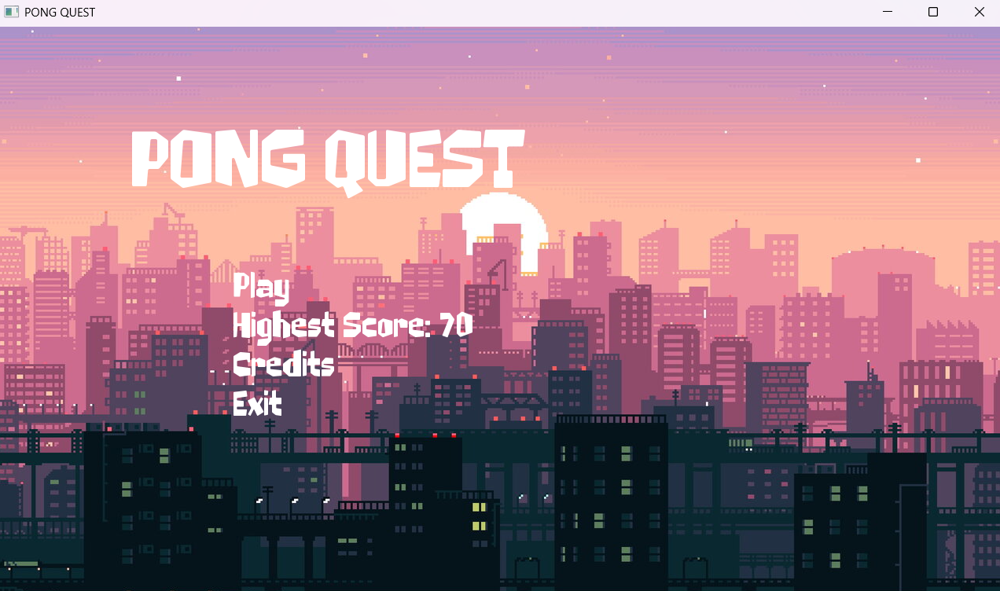
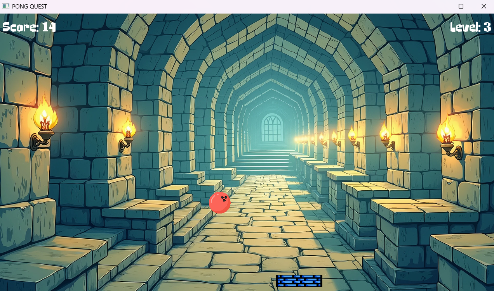

<p align="center">
  
  
  
</p>

<br/>

<p align="center">
  <strong style="font-size: 1.5em;">PONG QUEST</strong>
</p>
<p align="center">
  <em>A classic paddle-and-ball arcade game with a twist — built from scratch in C++ with SFML.</em>
</p>

<p align="center">
  <sub>1280×720 • Menu-driven • High-score persistence • Level progression</sub>
</p>

<br/>

---

## 🎮 What is this?

**PONG QUEST** is a single-file SFML game where you control a paddle at the bottom of the screen and keep a bouncing ball in play. Each time the ball hits the paddle, you score a point. Every 5 points the ball speeds up and you level up. Let the ball fall past the paddle and it’s game over — then try to beat your highest score.

| Feature | Description |
|--------|-------------|
| **Controls** | ← → arrow keys to move the paddle |
| **Goal** | Keep the ball bouncing; don’t let it go below the paddle |
| **Scoring** | +1 per paddle hit; level up every 5 points (ball gets faster) |
| **Persistence** | Highest score saved in `highest_score.txt` |
| **Flow** | Menu → Play / Credits / Exit → Game → Game Over (5s) → back to Menu |

---

## 🕹️ How to play

1. **Launch** the game and click **Play** on the menu.
2. **Move** the paddle with the **Left** and **Right** arrow keys.
3. **Bounce** the ball off the paddle as many times as you can.
4. **Survive** as the ball gets faster every 5 points.
5. On **Game Over**, wait ~5 seconds to return to the menu; your high score is saved automatically.

---

## ✨ Features

- **State flow:** `MENU` → `GAME` → `CREDITS` / `GAMEOVER` with clean transitions.
- **HUD:** Live score, current level, and highest score on screen.
- **Visuals:** Themed backgrounds (menu + in-game), textured paddle and ball.
- **Audio:** Background music (looping) and game-over jingle.
- **High score:** Stored in `highest_score.txt` and shown on the menu.

---

## 🛠️ Tech stack

| Layer | Technology |
|-------|------------|
| Language | C++ |
| Graphics / window / input | SFML 2.x (Graphics, Window, System) |
| Audio | SFML Audio |
| Build | Code::Blocks (`.cbp`) or g++ |
| Platform | Windows |

---

## 📁 Project layout

```
2nd SFML/
├── Second sfml.cpp      ← Main game (single source file)
├── 2nd SFML.cbp         ← Code::Blocks project
├── README.md
├── .gitignore
├── highest_score.txt    ← Created at runtime (high score)
└── assets (place in run directory):
    ├── brickwall.png    ← Paddle texture
    ├── bowling.png      ← Ball texture
    ├── b99.jpg          ← Menu background
    ├── b20.png          ← In-game background
    ├── StonePunk-eZD4g.ttf
    ├── music.ogg
    └── gameover.ogg
```

*Run the executable from the folder that contains the assets, or copy the assets into `bin/Debug/` (or your output directory) so the game finds them.*

---

## 🏗️ Build instructions

### Prerequisites

- **Windows**
- **C++ compiler:** MinGW (Code::Blocks) or MSVC
- **SFML 2.x** (Graphics, Window, System, Audio) — [sfml-dev.org](https://www.sfml-dev.org/)

### Option A — Code::Blocks

1. Install SFML and note the **include** and **lib** paths.
2. Open `2nd SFML.cbp` in Code::Blocks.
3. In **Project → Build options**, set the compiler **include** directory and linker **lib** directory to your SFML install.
4. Build (F9). Run from the directory that contains the asset files, or copy assets into `bin/Debug/`.

### Option B — Command line (g++)

```bash
g++ "Second sfml.cpp" -o PongQuest -I<path-to-SFML-include> -L<path-to-SFML-lib> -lsfml-graphics -lsfml-window -lsfml-system -lsfml-audio
```

Replace `<path-to-SFML-include>` and `<path-to-SFML-lib>` with your SFML paths. Run `PongQuest.exe` from a folder that contains the assets.

---

## ⚠️ Notes

- If an asset file is missing, the game still runs but prints an error to the console and may show placeholders or silent audio.
- `highest_score.txt` is created when you first achieve a score worth saving.
- The project is structured to be readable and easy to extend (e.g. extra levels, power-ups, more states).

---

## 👤 Author

**Rik**  
ETE, RUET • Roll: 2204051

---

<p align="center">
  <sub>Made with C++ and SFML</sub>
</p>

## 🎮 Game Screenshots

### Gameplay


### Game in Action

